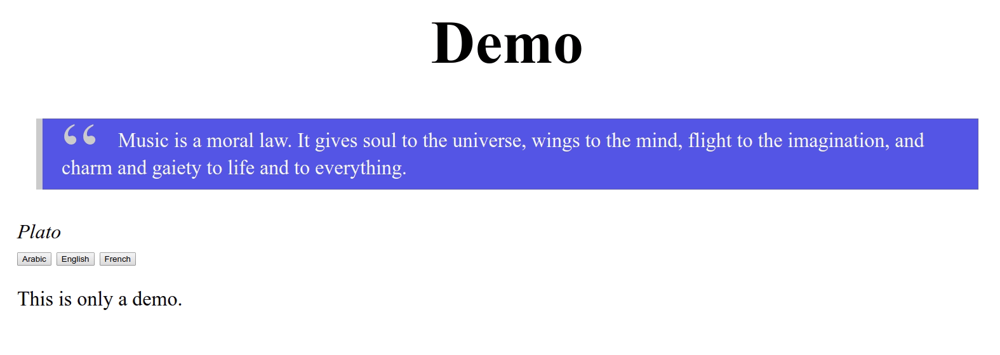

# jQuery L10N

A jQuery plugin that give you a eazy way, yet efficient to translate you static website easily.





## Install

### Via NPM

```
    npm i jquery.l10n
```

### Via Bower
```
    bower install jquery.l10n --save
```

<hr>

Thaught you can clone it:
```
    git clone git@github.com:karim88/jquery.l10n.git
```
or download it from [here](https://github.com/karim88/jquery.l10n/archive/master.zip)

## Usage

To translate your static website, you only need to import the plugin.

```html
<script src="jquery.l10n.js"></script>
```

Create a dictionary variable, then initialize the plugin

```javascript
    const words = {
        ar: {
            "Hello world!": "مرحبا بالعالم",
            ...
        },
        en: {
            "Hello world!": "Hello world!",
            ...
        },
        fr: {
            "Hello world!": "Bonjour monde",
            ...
        },
        jp: {
            "Hello world!": "こんにちは世界",
            ...
        }
    };

    const l10n = $('.gettext').l10n({
        lang: 'jp',
        dictList: words
    });
```

The last thing is to mark text to be translated

### html
```html
    <p class="gettext">Hello World!</p>
```

That's it, no more complexity.

you can also use it via javascript code
### javascript
```javascript
    const hello_word = l10n.getText('Hello World!');
    // hello_world = 'こんにちは世界'
```

## Options

```javascript
    $(selector).l10n({
        lang: 'en',
        dictList: words
    });
```

* The `selector` can be any CSS selector `.class`, `#id`, `[attribute]`, But not recommended to use CSS `elements` or `:pseudo-classes`

* lang: Code for the language to be translated to.<br>
default: `en`
> lang will be used in the first run or when localStorage is empty.
* dictList: The set of dictionaries of words and sentence to be used in the plugin.

## Methods

### getText

This function gets your desired text and translates it, if it's translation exist in the dictionary.

#### Paramters

* text: A string to be translated

```javascript
    const licence = l10n.getText('Your text');
    // licence = 'your translated text'
```

> Note that 'l10n' is the variable we stored in our initialized plugin, so it can be named as you wish.

### setLanguage

This function is needed so that you can change your language via you JS script.

#### Paramters

* lang: A string with you desired language code.

```javascript
    l10n.setLanguage('ar');
```